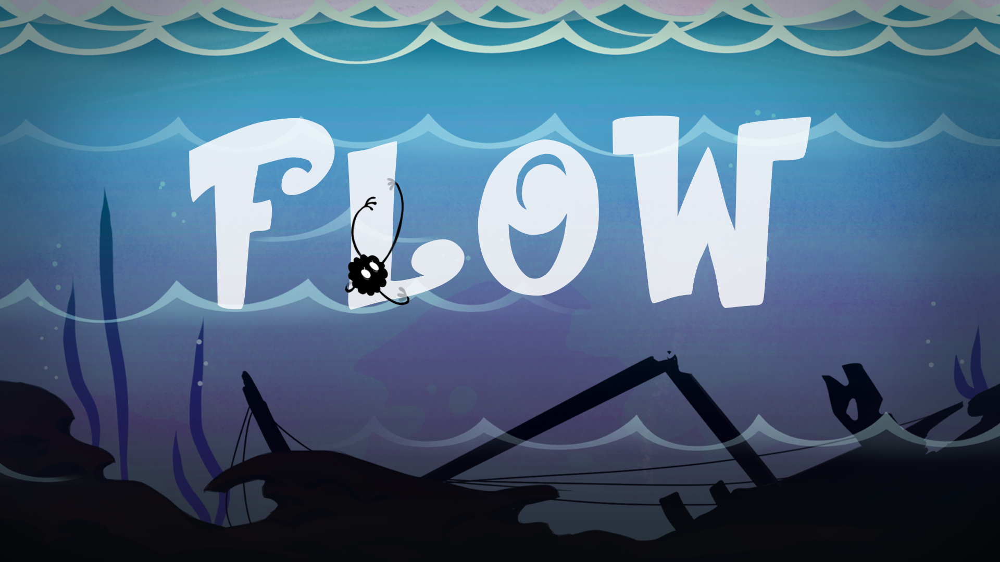

# Flow

Teamwork(Member name: Wenkai Song, Linhao Hu, Qiwei Zhang, Hanya Liu, Congcong Xie)

"Flow" made with Unity

Unity version : 2021.3.3f1

Github link: https://github.com/swk16/Flow

Video link: https://www.youtube.com/watch?v=EPysCxyiBAs 

Download link: https://s1w6k.itch.io/flow

## Project Description:

If I exist, it's because you need me.
Guide souls through the "river" and protect them from the devil's hand.
Tell them the truth and escort them to places they haven't been or want to go.
The "river" is located in the middle of the two worlds, and one must cross it after death.
Everyone has to cross their own “river".
Discover the truth of your obsession in this place, then re-experience and accept it.
Lead the soul to traverse more unseen places.
The journey is not smooth sailing,
A firm and brave heart can escort it to the final destination of the soul.
Flow is an adventure and survival game that takes about 7 minutes. The player controls a bottle protected
by a guardian spirit by using “ASWD” on keyboard so that it can successfully pass 4 levels and finally
reach the end of the game. Hope you like this game!

## Idea from :

we had seen this news before:

Recently, this picture has been hotly discussed on the social platform facebook. Just this April, someone in the United States picked up a bottle on the coast. Take a look at the picture. Someone is holding a transparent bottle with one hand and some gray inside. His ashes and a note that read in English "Please don't open me, my ashes are on a voyage at sea, and I started this journey from Cumberland Island in the southeastern United States." The note should be written on the deceased's own words, and the bottle should also contain his ashes. The owner seriously instructed the person who picked up the bottle on the note, "If you see me, please take a photo and send it here. E-mail, and throw me back into the sea, I want to keep traveling."

### Project task divisions

Game level design: the whole team

Coding part(C# scripts edit and build models in the game): Wenkai Song and Linhao Hu 
(You can find all the codes and scripts with this link:https://github.com/swk16/Flow/tree/main/Game/Assets/Scripts)

Arts part(illustrations and UI in the game ):Wenkai Song and Qiwei Zhang
(You can find all the illustrations with this link:https://github.com/swk16/Flow/tree/main/Illustrations)

Video in the game (words and videos): Congcong Xie and Hanya Liu

Music part: Hanya liu 

